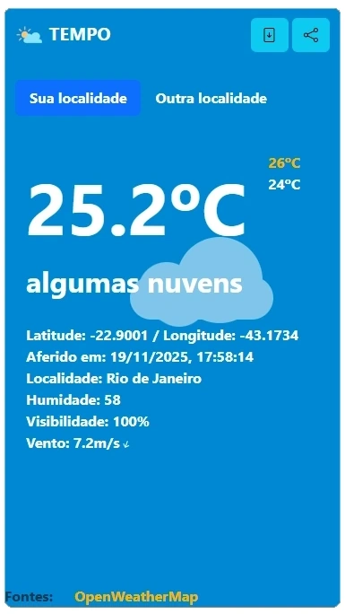

## TEMPO

Esse é um aplicativo que utiliza HTML5, CSS e Javascript para consultar dados meteorológicos

Abra [TEMPO](https://paulorobertoalexandresilva.github.io/tempo/) no seu `navegador` para ver o resultado

#### imagens
